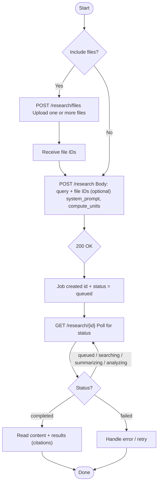

# Caesar API Documentation

Caesar’s Research API is a citation-first, AI-enabled research service. It searches the internet and proprietary data sources, gathers evidence, and synthesises answers with complete citations. It lets developers build sophisticated AI applications without maintaining their own search, indexing, or research infrastructure.

## Fundamentals

- Async first: Research jobs run asynchronously, so you can build responsive applications without waiting for results. You can track the status of your research jobs by calling the `GET /research/{id}` endpoint.
- Authentication: Access is managed via API keys, you can generate as many API keys as you need and limits are shared across all API keys.
- Beta period: The API is currently in beta, so there may be changes to the API endpoints and responses.

## Testing

You can use the API playground to test the API endpoints directly from the API reference.

## Research Workflow

